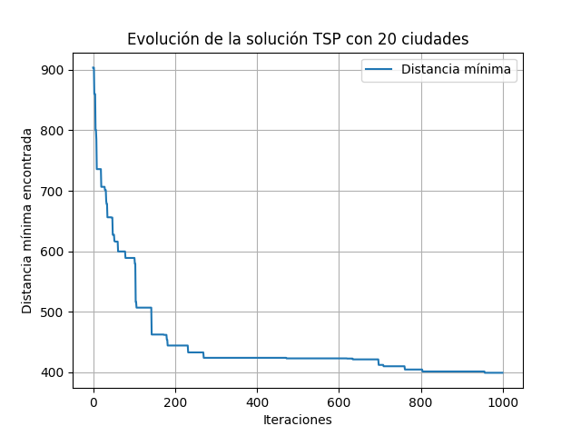

# Informe General - Comparación entre tamaños de ciudades

## 20 Ciudades
Mejor distancia encontrada: 399.02940959704813

### Evolución de la distancia mínima:

## 50 Ciudades
Mejor distancia encontrada: 992.8992167459389

### Evolución de la distancia mínima:

## 100 Ciudades
Mejor distancia encontrada: 2388.1053484391005

### Evolución de la distancia mínima:

